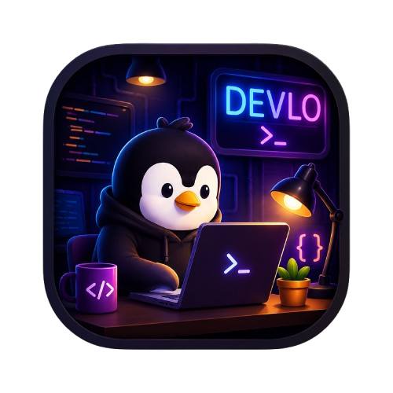

  
  <h1>Devlo</h1>
  
<em>Fase de Planeación</em>

  
Una plataforma inmersiva y gamificada para aprender programación desde cero hasta niveles avanzados.

---

## Descripción general

**Devlo** es una plataforma de aprendizaje de programación para **Web y dispositivos móviles** que combina educación y videojuegos para ofrecer una experiencia inmersiva y progresiva. El proyecto busca enseñar programación desde los fundamentos hasta áreas avanzadas como Inteligencia Artificial mediante niveles cortos, ejercicios interactivos, personajes animados y un sistema de gamificación que motive el aprendizaje constante.

Actualmente, el proyecto se encuentra en **fase de planeación**, definiendo la arquitectura, la identidad visual, el sistema de aprendizaje y las tecnologías que formarán parte de la plataforma.

## Problemática que resuelve

Las plataformas actuales suelen dividirse entre dos enfoques:

- **Plataformas muy entretenidas** pero con contenido limitado para programación.
- **Plataformas técnicas** con ejercicios complejos, poca gamificación y una curva de aprendizaje elevada para principiantes.

**Devlo** busca cerrar esa brecha ofreciendo una experiencia donde aprender programación resulte **accesible, entretenido y progresivo**, sin sacrificar la calidad técnica del contenido.

## Inspiración

El proyecto toma inspiración de distintas plataformas y productos modernos:

- **Duolingo**, por su sistema de progresión, niveles y gamificación.
- **LeetCode** y **HackerRank**, por los desafíos de programación y preparación para entrevistas técnicas.
- **Rive**, por sus ilustraciones y animaciones 2D con apariencia tridimensional.
- **Interfaces modernas** como Linear, GitHub, Arc Browser y Stripe, por su diseño limpio y atractivo.

> La propuesta no pretende replicar estas plataformas, sino combinar sus mejores características en una experiencia centrada exclusivamente en el aprendizaje de programación.

## Sistema de aprendizaje

El contenido estará organizado en **mundos y niveles** que representan distintas áreas de la programación, comenzando desde fundamentos y avanzando progresivamente hacia temas profesionales.

Los ejercicios combinarán diferentes dinámicas, entre ellas:

- Preguntas de opción múltiple.
- Completar fragmentos de código.
- Detectar y corregir errores.
- Predecir la salida de un programa.
- Explicar el comportamiento de un algoritmo.
- Ordenar instrucciones.
- Escribir pequeñas porciones de código (principalmente en PC).
- Desafíos prácticos y jefes finales por cada mundo.

**Objetivo principal:** Desarrollar el pensamiento lógico y la capacidad de comprender y analizar código antes de enfocarse en escribir programas complejos.

## Tecnologías propuestas

### Frontend
- 
- 
- 
- 
- 
- 

### Animaciones y experiencia visual
- **Antigravity**
- **Rive**
- **Motion One**
- **Lottie**
- **GSAP** (animaciones especiales)

### Editor de código
- **Monaco Editor**

### Backend y Base de Datos
- 
- 

### Contenido educativo
- Archivos **JSON** para almacenar cursos, niveles y ejercicios, facilitando su mantenimiento, versionado y escalabilidad.

## Estado del proyecto

El proyecto se encuentra actualmente **en desarrollo**. Las contribuciones y el acceso al código serán habilitados en fases posteriores.
